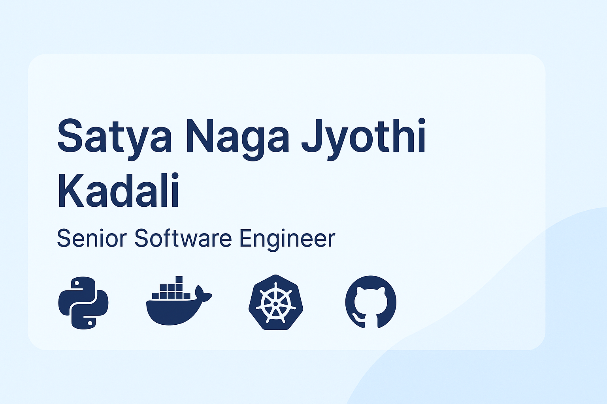

<!-- Banner Image Placeholder -->

# 👋 Hi, I'm Satya Naga Jyothi Kadali

**Senior Software Engineer | DevOps | SRE | Middleware & Performance Engineering**  

I have **10+ years of experience** in Integration, Infrastructure, DevOps, and Middleware. I specialize in **automation, performance optimization, and building reliable systems**.

---

## 🔧 Skills & Tech Stack

**Languages & Scripting**  
  
  

**Automation & CI/CD**  
  
  
  
  
  

**Containers & Orchestration**  
  
  

**Middleware & Integration**  
Oracle WebLogic (11g/12c), SOA Suite, OSB, JMS, SOAP/REST APIs, XML, XSLT  

**Monitoring Tools**  
  
  
  

**Performance & Reliability**  
WebLogic & JVM tuning, Incident Management, On-call Support  

**Tools & Utilities**  
Jira, Confluence, Postman, SOAP UI, PuTTY, WinSCP, ServiceNow  

**Operating Systems**  
 (RHEL)

---

## 📌 Featured Projects

### [Miro User Onboarding Automation](https://github.com/jyothi-k19/miro-onboarding)  
Automates onboarding by integrating **Miro, Azure AD, and Jira**.  

### [Jira Project Creation Automation](https://github.com/jyothi-k19/jira-project-automation)  
Automates **Jira project setup and role assignment** using Python scripts.  

### [WebLogic Domain Scaling Demo](https://github.com/jyothi-k19/weblogic-scaling-demo)  
Demonstrates **scaling WebLogic domains** from 6 → 12 servers with automation.  

### [Kubernetes Deployment Sample](https://github.com/jyothi-k19/k8s-deployment-sample)  
Deploys a containerized app on **Kubernetes using Helm**.

### [Infrastructure Automation with Puppet/Ansible](https://github.com/jyothi-k19/infra-automation)  
Scripts for provisioning and configuration management with **Puppet & Ansible**.

### [Grafana Monitoring Dashboards](https://github.com/jyothi-k19/monitoring-dashboards)  
Preconfigured dashboards for **system monitoring with Grafana & Prometheus**.

---

## 🏆 Achievements
- Multiple awards at Maersk: **STAR**, **CHAMP OF THE MONTH**, **Going Extra Mile**  
- Delivered automation solutions reducing manual effort by **60%+**

---

## 📊 GitHub Stats

  

---

## 🌍 Connect with Me
- [LinkedIn](https://www.linkedin.com/in/jyothi-kadali/)  
- 📧 ksn.jyothi1905@gmail.com

---

*Portfolio hosted on GitHub Pages*
